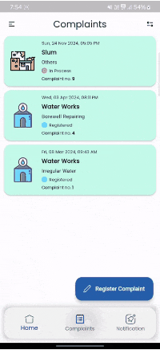
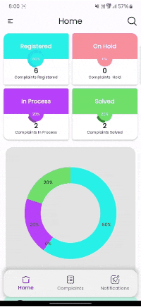
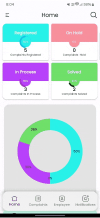
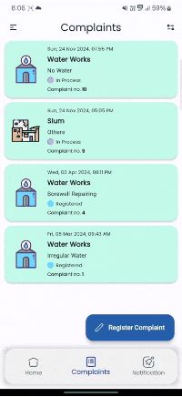
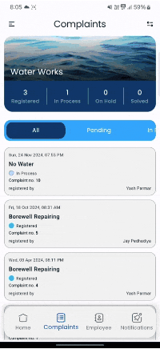

# Corporation Care (Admin)

A complaint registration app for municipal corporations, enabling users to register complaints, track updates, and view dashboards, 
while the admin app allows employees to manage complaints and HODs to oversee operations.

## Built using

The app is built using [Flutter](https://flutter.dev/) for cross-platform development, [Firebase](https://firebase.google.com/) for backend services, 
and [OneSignal](https://onesignal.com/) for push notifications.

## Features

- [**Complaint Registration** - Easily register and track complaints with real-time updates.](#complaint-registration)
- [**Employee Management** - Admins can manage employees, verify complaints, and assign tasks.](#employee-management)
- [**Home** - Dashboard for complaint statistics and user profiles.](#home)

   ### Complaint Registration
    Users can register complaints with detailed descriptions and attachments. Employees can update complaint statuses, add resolution notes,
   and ensure progress is communicated in real-time. Stay informed at every step until the complaint is resolved.
    

      
      &nbsp;&nbsp;&nbsp;
      
    

   ### Employee Management
    Admins can efficiently manage employees, assign complaints, and verify resolutions. HODs can oversee employee activity and streamline complaint handling processes.
    

      
    

   ### Home
    Your central hub for complaint management. View a dashboard with complaint statistics, track complaint statuses, and access your profile for a seamless user experience.
    

      
      &nbsp;&nbsp;&nbsp;
      
    

